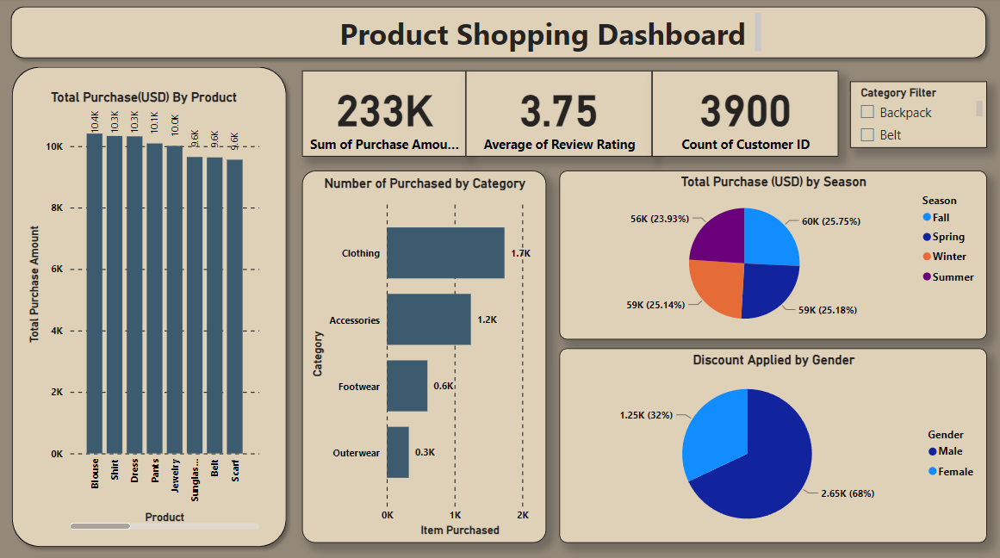

# Shopping Trend Data Visualization Project

## Dataset Description
The dataset contains information about customer demographics, purchase details, and product attributes. It includes columns such as Customer ID, Age, Gender, Item Purchased, Purchase Amount (USD), etc.

## Analysis Process
- Customer Analysis
- Product Analysis
- Purchase Analysis
- Customer Engagement Analysis

## How to Use
1. Download the Power BI project file.
2. Open the project in Power BI Desktop.
3. Navigate to to explore the visualizations and insights.

## Future Work
- Incorporate additional datasets for more comprehensive analysis.
- Enhance visualizations with advanced Power BI features.
- Automate data refresh and visualization updates.
